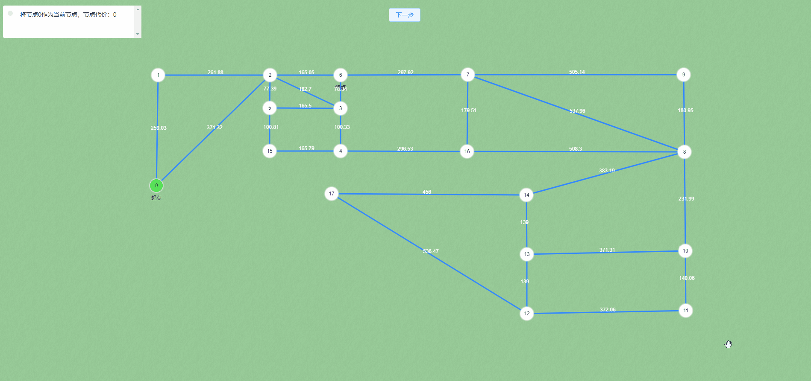

# 交互式学习Dijkstra寻路算法

## 项目演示


## 算法源码位于：`src/views/NavigateRoute.ts` [跳转](src/views/NavigateRoute.ts)

## 参考资料
- [知乎：A-Star（A*）寻路算法原理与实现](https://zhuanlan.zhihu.com/p/385733813)
- [B站：【算法】最短路径查找—Dijkstra算法](https://www.bilibili.com/video/BV1zz4y1m7Nq/?spm_id_from=333.337.search-card.all.click&vd_source=c21dc7a2f93289c8e3df1bde97f015b9)

## 项目启动

1. 克隆代码

```bash
 git clone https://github.com/Fate-ui/learn-dijkstra-algorithm-online.git
 cd learn-dijkstra-algorithm-online
```

2. 安装依赖

项目是在pnpm下开发的，如果没有安装pnpm，可以使用npm或者yarn代替。如若报错，请[安装pnpm](https://www.pnpm.cn/installation)
后尝试。

```bash
 pnpm install
```

3. 启动项目

```bash
 pnpm run dev
```

4. 打包项目

```bash
 pnpm run build
```

## 项目主要技术栈

#### vue3 + vite + typescript + pinia + element-plus + unocss + vueuse
#### 使用leaflet绘制操作主体画布
